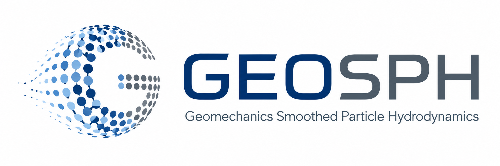

  <picture>
    <source
      media="(prefers-color-scheme: dark)"
      srcset="./assets/branding/geosph-logo-dark.png">
    <source
      media="(prefers-color-scheme: light)"
      srcset="./assets/branding/geosph-logo-light.png">
    
  </picture>

  

# GEOSPH

**GEOSPH** (Geomechanics Smoothed Particle Hydrodynamics) is a computational research framework for the numerical simulation of large-deformation geomechanics problems using **Smoothed Particle Hydrodynamics (SPH)**.

The software was originally developed by **Dr. Alomir Favero** as an extension of his doctoral research at Stanford University and has since evolved into a research platform supporting the development, verification, and application of advanced SPH formulations for geotechnical engineering.

Current capabilities include:

- Large-deformation geomechanics
- Elastoplastic constitutive modeling
- Soil-structure interaction
- Dynamic and quasi-static analyses
- Research implementations of advanced constitutive models

GEOSPH is intended primarily as a research and educational platform. New capabilities continue to be developed as part of ongoing research at Bucknell University and through collaborative research projects.

---

## How to Cite

If you use GEOSPH in academic work:

- Cite the GEOSPH software (Zenodo DOI) to acknowledge the software framework using the citation below.

> Favero Neto, A. H. (2026). **GEOSPH: A Smoothed Particle Hydrodynamics Framework for Computational Geomechanics** (Version 1.0.0) [Computer software]. Zenodo. https://doi.org/10.5281/zenodo.21384662

BibTeX and additional citation formats are available through the Zenodo record and GitHub's **"Cite this repository"** feature.

## Related Publications

The numerical methods implemented in GEOSPH have been described and applied in a number of publications, including:

- Favero Neto, A. H., Oliveira, G. R. A., & Cerna-Diaz, A. (2026). Meshless Numerical Modeling of Vane Shear Test. Proceedings of Geo-Congress 2026, Salt Lake City, USA. https://doi.org/10.1061/9780784486740.01
- del Castillo, E. M., Borja, R. I., & Favero Neto, A. H. (2026). A Coupled u–pw SPH Formulation for Hydromechanical Modeling of Retrogressive Landslides and Comparison With a Penalty-Based Approach. International Journal for Numerical and Analytical Methods in Geomechanics, 50(10), 4057-4334. https://doi.org/10.1002/nag.70322
- Favero Neto, A. H., Oliveira, G. R. A., Rasmussen, L. L., & Rógenes, E. (2025). Large Deformation and Critical State Analysis of the Fundão Tailings Dam. Proceedings of Geo-Extreme 2025, Long Beach, USA. https://doi.org/10.1061/9780784486511.009

---

## Software Foundation

GEOSPH is built upon the open-source **PySPH** framework developed by Ramachandran et al. (2021):

> Ramachandran, P., et al. (2021). *PySPH: A Python-Based Framework for Smoothed Particle Hydrodynamics*. ACM Transactions on Mathematical Software. https://doi.org/10.1145/3460773

The GEOSPH framework extends PySPH with numerical methods and capabilities specifically developed for computational geomechanics.

---

## Authors and Contributors

GEOSPH was originally conceived, designed, and implemented by:

**Dr. Alomir H. Favero Neto**

The project has benefited from contributions from collaborators and students on individual research projects.

Please see:

- **AUTHORS.md** for authorship information.
- **CONTRIBUTORS.md** for a complete list of contributors and their contributions.

---

## Contact

Questions regarding GEOSPH may be directed to:

**Prof. Alomir H. Favero Neto**  
Department of Civil and Environmental Engineering  
Bucknell University  
Email: alomir.favero@bucknell.edu

---

*Last updated: July 2026*
